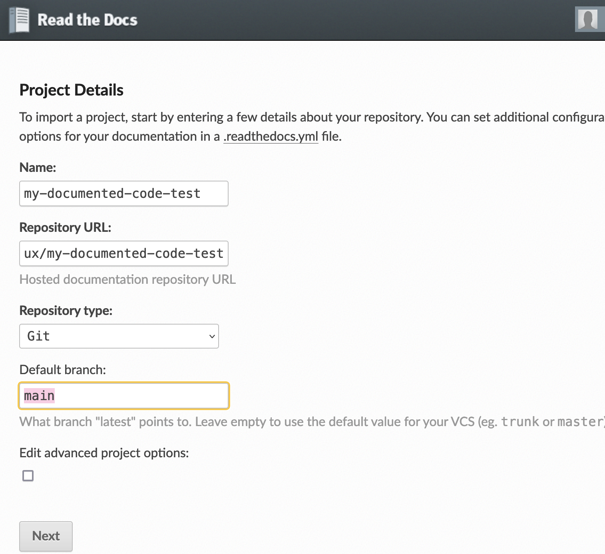
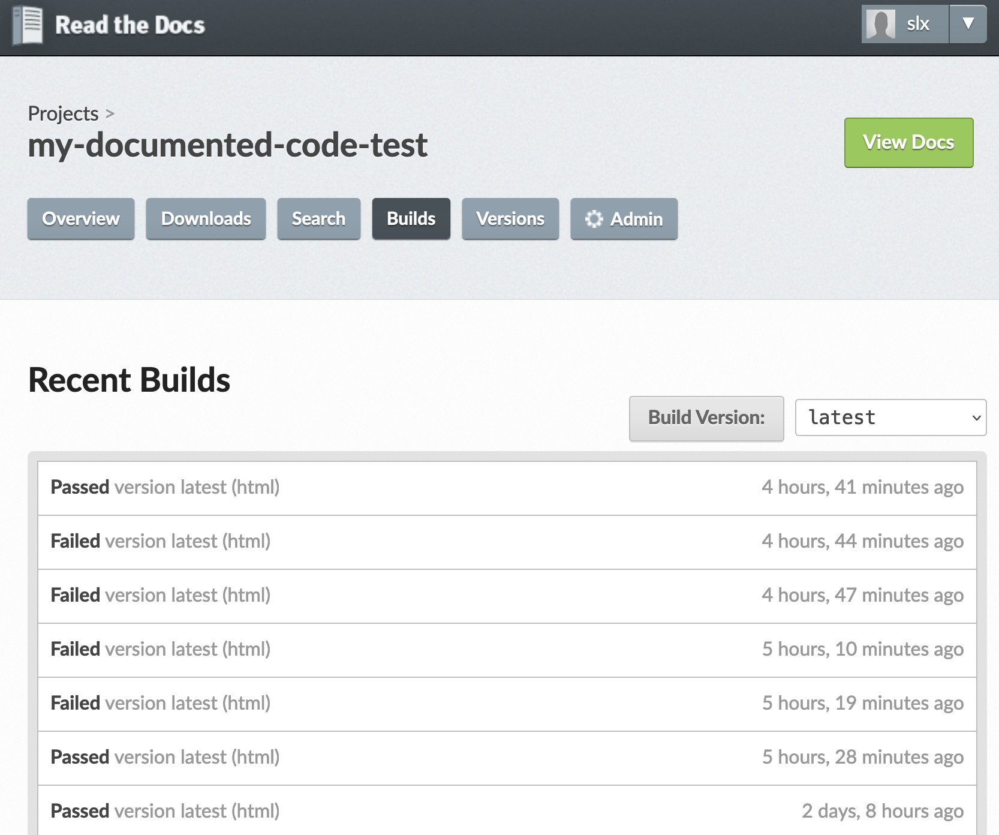
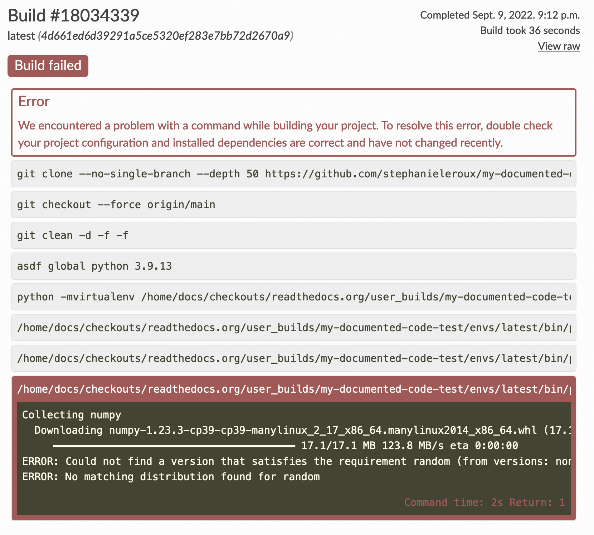

# Build the documentation

This  page explains how to write and publish a documentation about a python code with Reathedocs.
You'll notice that it  is itself built using Readthedocs.

If you don't wish to share your code nor its internal documentation, and you just wish to publish an "external" documentation about it, you can switch to the [simpler tuto](https://my-doc-online.readthedocs.io/en/latest/index.html) corresponding better to your case here.

---
## 0. Starting point: your code 
As a pre-requisite, you need:
* to have a code ready to share (here the example is given with a dummy Python package named `dummypackage`),
* this code is on github: [dummypackage on github](https://github.com/stephanieleroux/my-documented-code-test),
* this code has been documented with nice docstrings following official guidance (here example with NumPy style docstrings). More [info and examples](https://www.sphinx-doc.org/en/master/usage/extensions/example_numpy.html) about Numpy docstrings in the previous link.
* in your github project, you created a `/docs/` directory which will contain the documentation,
* you have Sphinx installed locally so that you can  build your documentation locally (if not, you can install with conda: `conda install -c anaconda sphinx` ;  see more [here about Sphinx](https://www.sphinx-doc.org/en/master/)).

As an example, here is the structure of the github project of  the `dummypackage` python code:
```
./my-documented-code-test/
├── LICENSE
├── README.md
├── docs
├── dummypackage
│   ├── mainscript.py
│   └── srcpy
│       ├── __init__.py
│       └── libtools.py
└── requirements.txt
```
In shorts, it contains a collection of tools in `/dummypackage/srcpy/libtools.py` and a main script `/dummypackage/mainscript.py` importing and using those tools.

---
## 1. Getting started on Reathedocs.org

### 1.1 Create your account:
The first thing you then need to do is to create an account on [ReadTheDocs.org](https://readthedocs.org/accounts/signup/). 

There is an [extensive documentation](https://docs.readthedocs.io/en/stable/tutorial/) about what/how you can do with readthedocs. Here we will go through the _basic steps_ to publish the documentation of the `dummypackage` code which already exist on github. Please refer to the above link for more advanced needs.

### 1.2 Connext to your github account
* From your account on Reathedocs, click on __"Connect your Accounts"__,
* Then connect your github account.

### 1.3 Import a Project
* Click on your login on the top right of the readthedocs page, then __"My Projects"__,
* Click on __"Import a Project"__,
* Click on __"Import Manually"__ and fill in the requested fields:



At this stage, you now need to configure your documentation so that it can build and render on-line. This is explained in the next section.

## 2. Set up your documentation

### 2.1 Add a .readthedoc.yaml config file 
You need to have a `.readthedocs.yaml` config file at the root of your Project (in our dummy example, it will be located in the `/my-documented-code-test/` directory).

Here is the simple config file used in the example:

```
# .readthedocs.yaml
# Read the Docs configuration file
# See https://docs.readthedocs.io/en/stable/config-file/v2.html for details

# Required
version: 2

# Set the version of Python and other tools you might need
build:
  os: ubuntu-20.04
  tools:
    python: "3.9"
    

# Build documentation in the docs/ directory with Sphinx
sphinx:
   configuration: docs/source/conf.py
   builder: html
   fail_on_warning: true


# Optionally declare the Python requirements required to build your docs
python:
   install:
   - requirements: requirements.txt
```

### 2.2 Add a requirements.txt file 
If you don't have one already, add a `requirements.txt` file at the root of your Project. This file indicates the requirements (packages) needed to use your package and its documentation.

In our example we have:
```
$$ my-documented-code-test>>vi requirements.txt 
numpy
sphinx>=4.4.0
myst_parser>=0.15.2
```
as we need `numpy` for our `dummypackage` to run, and we need `sphinx` and `myst_parser` for sphinx to build the documentation with markdown format.

### 2.3 Generate the architecture of your documentation with `sphinx-quickstart`
If you have Sphinx installed, just go in your `./docs/` directory and run:
```
sphinx-quickstart 
```
It will ask you a few questions. To follow this tuto's example, answer yes to `Separate source and build directories (y/n) y`.

After running sphinx-quickstart, the layout of the docs folder now looks like:

```
docs
├── Makefile
├── build
├── make.bat
└── source
    ├── _static
    ├── _templates
    ├── conf.py
    ├── index.rst
```
* There is now an index.rst file created in the `./source/` folder that will be the index  of your documentation.
* There is also a `conf.py` file that you need to tune according to the needs of your package and its documentation.
We will see in the following how to set those two files.

At this stage you could now build your html-rendered documentation using the command:
`make html` from the `./docs/` folder. However, it would not render well (and would probably fail) because you have not set the conf.py file yet.

### 2.4 Set up your `conf.py` file
This configuration will set options for Sphinx to generate the documentation either locally or by ReadtheDocs.
In our case we have: 
```
vi source/conf.py 
# Configuration file for the Sphinx documentation builder.
#
# This file only contains a selection of the most common options. For a full
# list see the documentation:
# https://www.sphinx-doc.org/en/master/usage/configuration.html

# -- Path setup --------------------------------------------------------------

# If extensions (or modules to document with autodoc) are in another directory,
# add these directories to sys.path here. If the directory is relative to the
# documentation root, use os.path.abspath to make it absolute, like shown here.
#
import os
import sys
sys.path.append(os.path.abspath('../../dummypackage/'))

# this is to tell reathedocs not to try to document numpy which is external.
autodoc_mock_imports = ['numpy']

# -- Project information -----------------------------------------------------

project = 'my-documented-code-test'
copyright = '2022, stephanie'
author = 'stephanie'

# The full version, including alpha/beta/rc tags
release = '0.0'

master_doc = 'index'

# -- General configuration ---------------------------------------------------

# Add any Sphinx extension module names here, as strings. They can be
# extensions coming with Sphinx (named 'sphinx.ext.*') or your custom
# ones.
#extensions = [
#    'sphinx.ext.autodoc'
#]
extensions = [
    'sphinx.ext.autodoc',
    'sphinx.ext.napoleon',
    'myst_parser'
]

napoleon_google_docstring = False

source_suffix = {
    '.rst': 'restructuredtext',
    '.txt': 'markdown',
    '.md': 'markdown',
}

myst_enable_extensions = ["dollarmath", "amsmath"]

# Add any paths that contain templates here, relative to this directory.
templates_path = ['_templates']

# List of patterns, relative to source directory, that match files and
# directories to ignore when looking for source files.
# This pattern also affects html_static_path and html_extra_path.
exclude_patterns = []


# -- Options for HTML output -------------------------------------------------

# The theme to use for HTML and HTML Help pages.  See the documentation for
# a list of builtin themes.
#
#html_theme = 'classic'
html_theme = 'sphinx_rtd_theme'


# Add any paths that contain custom static files (such as style sheets) here,
# relative to this directory. They are copied after the builtin static files,
# so a file named "default.css" will overwrite the builtin "default.css".
#html_static_path = ['_static']

exclude_patterns = ['_build', 'Thumbs.db', '.DS_Store']
```

* The lines :
```
import os
import sys
sys.path.append(os.path.abspath('../../dummypackage/'))
```
are important so that sphinx knows where your python package is.

* The line `autodoc_mock_imports = ['numpy']` is necessary to build the documentation on-line with readthedocs, otherwise readthedocs will fail looking for numpy inside our package.

* The `'sphinx.ext.napoleon',` extension is so that sphinx recognizes the numpy-style docstrings in your code. And you also need to switch off Googlestyle docstrings with `napoleon_google_docstring = False`.

* The extension 'myst_parser' and the `source_suffix` list is not necessary but it can be used to anable markdown format and latex equations within the documentation. `myst_enable_extensions = ["dollarmath", "amsmath"]` is also needed in that case.

### 2.6 Generate the documentation from your code docstrings
In the `./docs/` folder, run: 
```
sphinx-apidoc -f -o ./source/ ../dummypackage/
```
This should generate `.rst` files automatically describing your python package from its docstrings.
In our example:
```
>> sphinx-apidoc -f -o ./source/ ../dummypackage/
Creating file ./source/mainscript.rst.
Creating file ./source/srcpy.rst.
Creating file ./source/modules.rst.
```

And here is what the `modules.rst` files contains:
```
dummypackage
============

.. toctree::
   :maxdepth: 4

   mainscript
   srcpy
~       
```

### 2.7 Set up the index.rst file
This file is the index of your documentation. You can set which files will be included. You can add as many files as you want, in rst format (or in markdown if you have unable this option - see above).
In our example, the index file looks like:
```
.. my_dumb_math_tools documentation master file, created by
   sphinx-quickstart on Fri Sep  9 13:56:51 2022.
   You can adapt this file completely to your liking, but it should at least
   contain the root `toctree` directive.

Welcome to my_dumb_math_tools's documentation!
==============================================

.. toctree::
   :maxdepth: 2
   :caption: Contents:

   introduction
   getting_started
   anotherpage
   build_documentation
   modules


Indices and tables
==================

* :ref:`genindex`
* :ref:`modindex`
* :ref:`search`
```

The  pages to include in the documentation are listed in the `toctree::` section. Note that the `modules` page was added in the list (it was generated by the  `sphinx-apidoc` command from the code docstrings - see above). The other pages (introduction, getting started, etc) are simple text pages that were added mannually into the folder and containing some aspects of the documentation (other than the docstrings themseves).

### 2.6 Set up you index.rst file
This is where you set which pages will be included in the 

---
## 3. Build your documentation 
### Locally
* In order to check that your documentation builds fine and looks nice, you can build it locally by running
`make html` from the `./docs/` folder.
* You can check the rendered html pages by opening `./docs/build/html/build_documentation.html 
` in your browser.

### Build on Readthedocs
Once everything looks fine locaaly, you can push everything to your gihub Project. 

Then check on the readthedocs build page. In our example: [https://readthedocs.org/projects/my-documented-code-test/builds/](https://readthedocs.org/projects/my-documented-code-test/builds/).
If you had connected your github Project to your reathedocs account as explained in this tuto, a "webhook" was generated automatically so that every `push` or 'pull request` on your github project will send a notification to your readthedocs account and will trigger a new build  of your documentation. If for some reason the webhook was not generated, you can set it up manually following these [instructions](https://docs.readthedocs.io/en/stable/connected-accounts.html).

Your screen should look like this:



You can click on the latest build to see the details and try to debug if it failed.

As an example of a failed build, here is how it looks like before the `autodoc_mock_imports = ['numpy']` was  added in the `conf.py` file. It fails  because reathedocs will try to install/load  `numpy` to build the documentation (since 'numpy` is part of the required environment of the python package):




---
## 4. Troubleshooting
You might experience that the documentation can build fine locally but does not render the code docstrings well on the readthedocs site. If so:
* Check out the warning and error messages from the readthedocs build page (to get more details, click on 'view raw` link on the right). 
* Make sure the path set in the `conf.py` indicates the root of the python package:  `sys.path.append(os.path.abspath('../../dummypackage/'))` in our example.
* If the build fails because of a missing external package, add it in the `autodoc_mock_imports` list in the `conf.py` file:  `autodoc_mock_imports = ['numpy','missingpackage1','othermissingpackage2']`.
* Last but not least: it is recommended to avoid underscores in the package and python code files. It might solve some of your problems.


